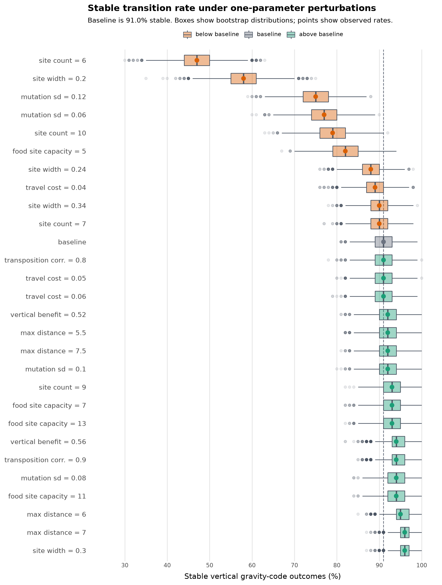
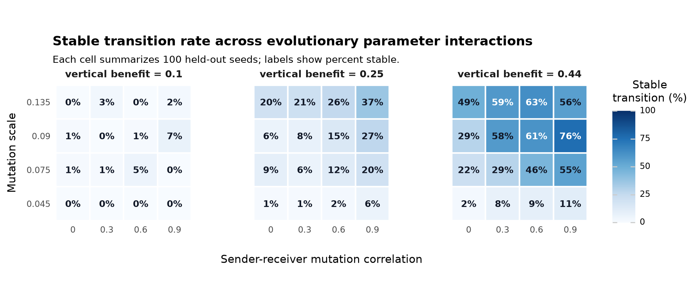
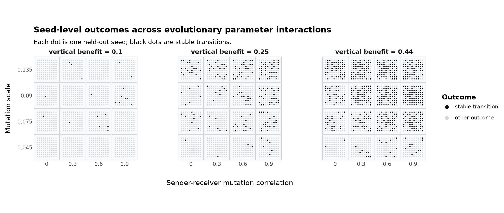

# Introduction

Honeybee waggle dances can recruit nestmates to resources away from the nest. One
ecological question is when a costly spatial signal is worth maintaining, and a second
evolutionary question is how a direct pointing signal could become a gravity-referenced
vertical-comb code. Empirical and theoretical work suggests that dance value depends on
resource density, patch size, reward, distance, and habitat [@sherman_visscher_2002;
@dornhaus_chittka_2004; @dornhaus_etal_2006; @beekman_lew_2008;
@donaldson_matasci_dornhaus_2012; @schurch_gruter_2014; @price_gruter_2015].

This report covers only the current v2 model and the tracked v2 result files. The model
is intentionally small: it asks whether horizontal-start populations can evolve both a
vertical comb and a sender-receiver gravity code under simple foraging, inheritance, and
mutation rules.

# Current Model

Colonies are the reproducing entities. Workers are behavioral samples from heritable
colony means. A colony has seven mean traits: directional-bias investment, receiver
attention, sender transposition, receiver transposition, search limit, comb tilt, and
comb orientation. Directional bias controls the concentration of dance signals; receiver
attention controls whether a worker follows an available dance; sender and receiver
transposition interpolate between direct pointing and a sun/gravity-referenced code.

Each foraging episode samples food sites with direction, distance, angular width, value,
and capacity. Workers act sequentially. If dances are available, a worker may follow
one; otherwise it searches in a random direction. A successful worker always adds a
dance for the discovered site, whether the worker found it independently or by following
another dance. Dance cost is therefore paid for every successful worker that produces a
signal.

Comb geometry determines the available directional cues. Direct pointing projects the
horizontal food direction onto the comb plane. Gravity-referenced communication uses the
projection of gravity into the comb plane together with the episode sun azimuth. A
horizontal comb has no gravity reference in the dance plane; the gravity cue strengthens
as the comb becomes vertical. The reported v2 transition experiments use axial comb
orientation, so orientations that differ by 180 degrees represent the same comb plane.

For a worker with sender transposition \(s\), the encoded dance angle is a weighted
circular mean of direct and gravity-referenced angles:

\[
\mu =
\operatorname{cmean}\left(
  (D, (1-s)q_D),\,
  (G, sq_G)
\right).
\]

The emitted signal is sampled from a von Mises distribution centered on \(\mu\), with
concentration proportional to directional-bias investment, and then perturbed by
production noise. A receiver with transposition \(r\) applies the analogous weighted
decoding rule and interpretation noise.

Episode payoff is food value minus search/travel cost, dance cost, and attention cost.
A vertical comb can multiply net episode payoff:

\[
P_e = F_e (1 + \alpha t),
\]

where \(t\) is comb tilt and \(\alpha\) is the vertical-comb benefit. This benefit does
not rescue a colony whose foraging payoff has collapsed. Daughter colonies are sampled
in proportion to payoff. All heritable traits mutate with the shared mutation scale;
sender and receiver transposition mutations may be correlated by \(\rho\).

Unless stated otherwise, v2 runs use 60 colonies, 80 workers per colony, 120
generations, 50 foraging episodes per colony per generation, 12 foraging attempts per
episode, maximum search distance 8, food value 1, baseline dance cost 0, directional
cue cost 0.02, attention cost 0.01, dance-production noise 0.18, interpretation noise
0.12, within-colony worker variation 0.08, horizontal initial combs, axial orientation,
and the linear vertical-comb modifier \(1+\alpha t\).

A seed is counted as a stable vertical gravity-code outcome when final mean comb tilt is
at least 0.80 and both final mean sender and receiver transposition are at least 0.50.
Gravity reached means both transposition traits crossed 0.50 at any generation. A seed
is counted as collapsed if mean success falls to 0.02 or below.

# Experiments

The v2 Snellius pipeline ran the following sequence:

| Stage | Source files | Seed panel |
|:------|:-------------|:-----------|
| Optuna search | `results/food_transition_v2_optuna_trials.csv`, `results/food_transition_v2_optuna_seed_metrics.csv` | seeds 100-109 |
| Candidate confirmation | `results/food_transition_v2_confirmation_*` | seeds 110-149 |
| Held-out validation | `results/food_transition_v2_validation_*` | seeds 200-299 |
| One-parameter sensitivity | `results/food_transition_v2_oat_sensitivity_*`, `results/food_transition_v2_sensitivity_refinement_*` | seeds 300-399 |
| Evolutionary interaction grid | `results/food_transition_v2_evolutionary_interaction_*` | seeds 300-399 |

The Optuna search evaluated 512 trials over food-site count, angular width, capacity,
vertical-comb benefit, maximum food distance, travel cost, mutation scale, and
sender-receiver mutation correlation. Food value was fixed at 1.0. The objective
prioritized stable seed count, then a bounded near-miss progress score, and penalized
collapse. Of the 512 completed trials, 61 were stable in all ten optimization seeds and
another 109 were stable in nine of ten seeds.

# Results

## Held-Out Validation

The top confirmation candidates were rerun on 100 held-out seeds. All five validation
candidates produced frequent stable vertical gravity-code transitions and no collapse
events.

| Candidate | Sites | Width | Cap. | \(\alpha\) | Max dist. | Travel cost | Mut. sd | \(\rho\) | Stable | Success | \(t_f\) | \(m_f\) |
|:----------|------:|------:|-----:|-----------:|----------:|------------:|--------:|---------:|-------:|--------:|--------:|--------:|
| trial_257 | 8 | 0.270 | 9 | 0.600 | 6.5 | 0.055 | 0.090 | 1.0 | 99/100 | 0.563 | 0.856 | 0.832 |
| trial_471 | 8 | 0.240 | 8 | 0.580 | 6.5 | 0.055 | 0.090 | 1.0 | 95/100 | 0.516 | 0.848 | 0.822 |
| trial_425 | 8 | 0.340 | 9 | 0.600 | 8.0 | 0.055 | 0.090 | 0.8 | 93/100 | 0.618 | 0.852 | 0.805 |
| trial_243 | 8 | 0.280 | 9 | 0.540 | 7.0 | 0.055 | 0.090 | 1.0 | 88/100 | 0.572 | 0.841 | 0.823 |
| trial_139 | 8 | 0.290 | 9 | 0.540 | 8.0 | 0.055 | 0.110 | 1.0 | 86/100 | 0.547 | 0.834 | 0.805 |

Here \(t_f\) is final mean comb tilt and \(m_f\) is final mean of the lower sender or
receiver transposition value. The strongest held-out candidate, `trial_257`, reached
stable vertical gravity-code outcomes in 99 of 100 seeds. The candidates share a narrow
region of parameter space: eight food sites, moderate angular widths, high
vertical-comb benefit, non-negligible travel cost, moderate-to-high mutation scale, and
strong sender-receiver mutation coupling.

## Sensitivity

The sensitivity panels use `trial_257` as the baseline. On the later 100-seed
sensitivity panel, the baseline produced 91 stable transitions, 98 gravity-reached
seeds, 92 vertically retained seeds, and no collapses. Mean final success was 0.561.

<figure id="fig:oat-sensitivity-stable-delta" class="figure">

<figcaption>
Coarse v2 one-parameter sensitivity around the validated baseline. Boxes show
seed-bootstrap distributions of the stable vertical gravity-code fraction; points show
the observed 100-seed stable fraction. The dashed line marks the baseline.
</figcaption>
</figure>

The refined sensitivity results identify two main cliffs: too few food sites and too
low a mutation scale. Other one-parameter perturbations are less damaging within the
tested ranges.

| Parameter | Baseline | Weakest tested value | Stable | Strongest tested value | Stable |
|:----------|:---------|:---------------------|-------:|:-----------------------|-------:|
| Food-site count | 8 | 5 | 5/100 | 9 | 93/100 |
| Food-site width | 0.270 | 0.200 | 58/100 | 0.300 | 96/100 |
| Food-site capacity | 9 | 5 | 82/100 | 11 | 94/100 |
| Max food distance | 6.5 | 5.5 or 7.5 | 92/100 | 7.0 | 96/100 |
| Travel cost | 0.055 | 0.040 | 89/100 | 0.050, 0.055, or 0.060 | 91/100 |
| Vertical-comb benefit | 0.600 | 0.480 | 83/100 | 0.560 | 94/100 |
| Mutation scale | 0.090 | 0.050 | 47/100 | 0.080 | 94/100 |
| Sender-receiver correlation | 1.0 | 0.600 | 87/100 | 0.900 | 94/100 |

The food-site-count result is the sharpest ecological boundary. Reducing the baseline
from eight sites to five almost eliminates the transition even though colonies still
forage. Mutation scale is the sharpest evolutionary boundary: at 0.05, many seeds
retain verticality or partial transposition but fail to coordinate both by generation
120. The baseline does not require perfect sender-receiver coupling, but high coupling
remains favorable.

## Evolutionary-Parameter Interaction

The interaction grid keeps the validated ecology fixed but varies vertical-comb
benefit, mutation scale, and sender-receiver mutation correlation. It maps whether
mutation parameters can compensate for weaker architectural benefit.

<figure id="fig:evolutionary-interaction-stable-heatmap" class="figure">

<figcaption>
Stable vertical gravity-code transition rates across the v2 interaction grid. Panels
vary vertical-comb benefit; columns vary sender-receiver mutation correlation; rows vary
the shared mutation scale. Each cell summarizes 100 held-out seeds.
</figcaption>
</figure>

| \(\alpha\) | Mean stable rate across cells | Best cell | Best stable count |
|-----------:|------------------------------:|:----------|------------------:|
| 0.10 | 1.3% | mutation 0.090, \(\rho=0.9\) | 7/100 |
| 0.25 | 13.6% | mutation 0.135, \(\rho=0.9\) | 37/100 |
| 0.44 | 39.6% | mutation 0.090, \(\rho=0.9\) | 76/100 |

<figure id="fig:evolutionary-interaction-seed-outcomes" class="figure">

<figcaption>
Seed-level view of the interaction grid. Each dot is one seed in one parameter cell;
black dots are stable vertical gravity-code transitions and pale gray dots are other
outcomes.
</figcaption>
</figure>

Low vertical-comb benefit is not rescued by sender-receiver coupling. At
\(\alpha=0.10\), stable outcomes are almost absent. At \(\alpha=0.25\), transitions
remain minority outcomes even at high mutation and high coupling. At \(\alpha=0.44\),
intermediate mutation and strong coupling produce the best cell, but the rate remains
below the validated baseline because the grid does not include the baseline's higher
\(\alpha=0.60\) value.

# Conclusion

In the current v2 model, horizontal-start colonies can reliably evolve a vertical comb
and a gravity-referenced sender-receiver code. The strongest validated candidate is
stable in 99 of 100 held-out seeds, and the same parameter region remains stable in 91
of 100 later sensitivity seeds.

The result is conditional, not universal. The transition depends on an ecology with
enough recruitable food sites, a substantial vertical-comb benefit, and mutation
parameters that let comb tilt and sender-receiver transposition move together. Too few
food sites or too small a mutation scale returns the population to productive but flat
direct pointing. Weak vertical-comb benefit is not compensated for by mutation coupling.

The main conclusion is therefore modest: the v2 model contains a reproducible transition
corridor, but that corridor is parameter-dependent. The next scientific step is to make
the vertical-comb benefit and food ecology less abstract, then test whether the same
transition remains under more explicit biological constraints.

# Reproducibility

The working report is `report/report.md` and is rendered with:

```sh
python -u experiments/render_report_html.py
```

The v2 figures in this report were regenerated from tracked CSVs with:

```sh
python -u experiments/plot_oat_sensitivity_effects.py \
  --points results/food_transition_v2_oat_sensitivity_points.csv \
  --events results/food_transition_v2_oat_sensitivity_events.csv \
  --output report/figures/oat_sensitivity_stable_delta

python -u experiments/plot_evolutionary_interaction_heatmap.py \
  --group-summary results/food_transition_v2_evolutionary_interaction_group_summary.csv \
  --output report/figures/evolutionary_interaction_stable_heatmap

python -u experiments/plot_evolutionary_interaction_seed_outcomes.py \
  --events results/food_transition_v2_evolutionary_interaction_events.csv \
  --output report/figures/evolutionary_interaction_seed_outcomes_binary
```

# References
