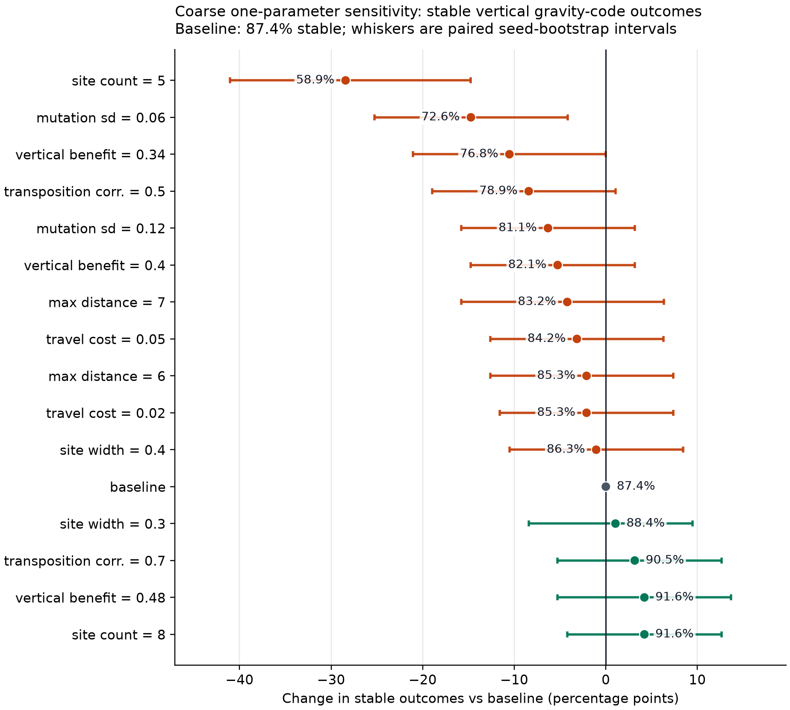
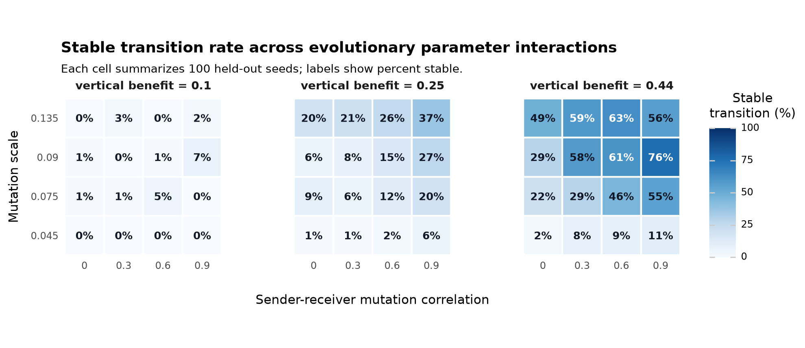
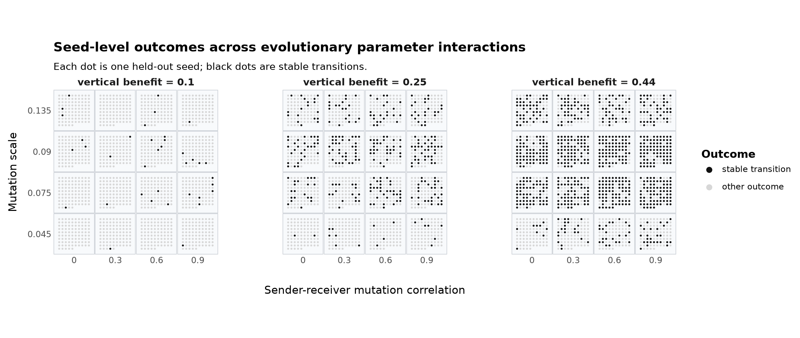

# Introduction

Honeybee waggle dances can recruit nestmates to resources away from the nest. One
ecological question is when a costly spatial signal is worth maintaining, and a second
evolutionary question is how a direct pointing signal could become a gravity-referenced
vertical-comb code. Empirical and theoretical work suggests that dance value depends on
resource density, patch size, reward, distance, and habitat [@sherman_visscher_2002;
@dornhaus_chittka_2004; @dornhaus_etal_2006; @beekman_lew_2008;
@donaldson_matasci_dornhaus_2012; @schurch_gruter_2014; @price_gruter_2015].

This report covers the current v2 model run under two direct-decode variants and their
tracked result files. The model is intentionally small: it asks whether horizontal-start
populations can evolve both a vertical comb and a sender-receiver gravity code under
simple foraging, inheritance, and mutation rules. The v2 pipeline (flatten decode) and v3
pipeline (unproject decode) differ only in how direct-pointing projects the food direction
onto the comb plane; all other model parameters and the evolutionary pipeline structure
are identical.

# Current Model

Colonies are the reproducing entities. Workers are behavioral samples from heritable
colony means. A colony has seven mean traits: directional-bias investment, receiver
attention, sender transposition, receiver transposition, search limit, comb tilt, and
comb orientation. Directional bias controls the concentration of dance signals; receiver
attention controls whether a worker follows an available dance; sender and receiver
transposition interpolate between direct pointing and a sun/gravity-referenced code.

Each foraging episode samples food sites with direction, distance, angular width, value,
and capacity. Workers act sequentially. If dances are available, a worker may follow
one; otherwise it searches in a random direction. A successful worker always adds a
dance for the discovered site, whether the worker found it independently or by following
another dance. Dance cost is therefore paid for every successful worker that produces a
signal. This describes the angular-width food model used by the vertical-transition
pipelines below; the food-distribution experiment (see *Direct-Pointing Communication and
Food Distribution*) swaps in an ecologically grounded extension -- physical disk patches
in meters, variable Gamma forays, capacity that scales with patch area, capacity-
conditional dancing, and Poisson site counts -- all of which are opt-in settings that
leave the pipelines here unchanged.

Comb geometry determines the available directional cues. Direct pointing projects the
horizontal food direction onto the comb plane. Gravity-referenced communication uses the
projection of gravity into the comb plane together with the episode sun azimuth. A
horizontal comb has no gravity reference in the dance plane; the gravity cue strengthens
as the comb becomes vertical. The reported v2 transition experiments use axial comb
orientation, so orientations that differ by 180 degrees represent the same comb plane.

For a worker with sender transposition $s$, the encoded dance angle is a weighted
circular mean of direct and gravity-referenced angles:

$$
\mu =
\operatorname{cmean}\left(
  (D, (1-s)q_D),\,
  (G, sq_G)
\right).
$$

The emitted signal is sampled from a von Mises distribution centered on $\mu$, with
concentration proportional to directional-bias investment, and then perturbed by
production noise. A receiver with transposition $r$ applies the analogous weighted
decoding rule and interpretation noise.

Episode payoff is food value minus search/travel cost, dance cost, and attention cost.
A vertical comb can multiply net episode payoff:

$$
P_e = F_e (1 + \alpha t),
$$

where $t$ is comb tilt and $\alpha$ is the vertical-comb benefit. This benefit does
not rescue a colony whose foraging payoff has collapsed. Daughter colonies are sampled
in proportion to payoff. All heritable traits mutate with the shared mutation scale;
sender and receiver transposition mutations may be correlated by $\rho$.

Unless stated otherwise, v2 runs use 60 colonies, 80 workers per colony, 120
generations, 50 foraging episodes per colony per generation, 12 foraging attempts per
episode, maximum search distance 8, food value 1, baseline dance cost 0, directional
cue cost 0.02, attention cost 0.01, dance-production noise 0.18, interpretation noise
0.12, within-colony worker variation 0.08, horizontal initial combs, axial orientation,
and the linear vertical-comb modifier $1+\alpha t$.

A seed is counted as a stable vertical gravity-code outcome when final mean comb tilt is
at least 0.80 and both final mean sender and receiver transposition are at least 0.50.
Gravity reached means both transposition traits crossed 0.50 at any generation. A seed
is counted as collapsed if mean success falls to 0.02 or below.

# Experiments

Both pipelines share the same stage structure and seed panels. The v3 pipeline omits
the sensitivity and interaction stages; those remain v2-only for now.

| Pipeline | Stage | Source files | Seed panel |
|:---------|:------|:-------------|:-----------|
| v2 (flatten) | Optuna search | `results/food_transition_v2_optuna_trials.csv`, `results/food_transition_v2_optuna_seed_metrics.csv` | seeds 100-109 |
| v2 (flatten) | Candidate confirmation | `results/food_transition_v2_confirmation_*` | seeds 110-149 |
| v2 (flatten) | Held-out validation | `results/food_transition_v2_validation_*` | seeds 200-299 |
| v2 (flatten) | One-parameter sensitivity | `results/food_transition_v2_oat_sensitivity_*`, `results/food_transition_v2_sensitivity_refinement_*` | seeds 300-399 |
| v2 (flatten) | Evolutionary interaction grid | `results/food_transition_v2_evolutionary_interaction_*` | seeds 300-399 |
| v2 (flatten) | Low-benefit generation budget | `results/food_transition_v2_low_regime_generation_sensitivity_*`, `..._mut_0p075_*` | seeds 300-399 |
| v2 (flatten) | Food-distribution communication | `results/food_distribution_v2_*` | seeds 400-449 |
| v3 (unproject) | Optuna search | `results/food_transition_v3_optuna_trials.csv`, `results/food_transition_v3_optuna_seed_metrics.csv` | seeds 100-109 |
| v3 (unproject) | Candidate confirmation | `results/food_transition_v3_confirmation_*` | seeds 110-149 |
| v3 (unproject) | Held-out validation | `results/food_transition_v3_validation_*` | seeds 200-299 |

The Optuna search evaluated 512 trials over food-site count, angular width, capacity,
vertical-comb benefit, maximum food distance, travel cost, mutation scale, and
sender-receiver mutation correlation. Food value was fixed at 1.0. The objective
prioritized stable seed count, then a bounded near-miss progress score, and penalized
collapse. Of the 512 completed trials, 61 were stable in all ten optimization seeds and
another 109 were stable in nine of ten seeds.

# Results

## Direct-Pointing Communication and Food Distribution

Before the vertical transition, a more basic question is when the direct-pointing
dance is worth maintaining at all. We test this on a comb held flat
(`evolve_comb_tilt` off, `initial_comb_tilt` 0), which leaves the gravity
reference strength at zero and the transposition traits inert, so only the
direct-pointing dance is in play, and we sweep the food ecology across 50
held-out seeds (400-449) over 60 generations.

This experiment replaces the abstract angular-width food model with an
ecologically grounded geometry, all lengths in meters. Food sites are physical
**disks** whose radius is drawn per site from a lognormal, independent of
distance; a forager captures a site when its straight outbound path intersects
the disk, so the effective angular tolerance is approximately
$\arcsin(\text{radius}/\text{distance})$ and *shrinks with distance*, because a
fixed patch subtends a smaller angle when farther away. Each foray's outbound
distance is drawn from a Gamma with the colony's evolved mean, rather than a hard
range cutoff. Total patch resource scales with area, so a disk's **capacity grows
with its radius squared** while per-visit value stays fixed. Recruitment is
itself an evolvable decision: a successful scout dances with probability
$1 - (1-s)^{c}$ given remaining capacity $c$, where the propensity $s$ is a
heritable trait, so an exhausted patch never seeds a dance. Finally the number of
sites per episode is Poisson with an evolving mean. The grid crosses mean site
count (1 to 24) against median patch radius (15 to 600 m); food sites sit
750-6000 m from the nest.

The outcome is the in-run *recruitment advantage*: among foraging attempts where
a dance was available, the success rate of dance-followers minus that of matched
non-followers (workers who could have followed but, by the receiver-attention
coin flip, searched at random). Because the follow decision is randomized within
the same episodes, this is a contemporaneous estimate of what the dance actually
buys, and it separates useful communication from a directional-bias trait that
has merely drifted upward under weak selection. The latter matters here: in the
smallest-patch ecologies mean directional bias still sits near 0.35-0.40, which
would clear a naive trait threshold, yet the dance is essentially useless
(recruitment advantage below 0.06, foraging success near zero).

<figure id="fig:food-distribution-disk-grid" class="figure">

<figcaption>
Recruitment advantage (left) and evolved directional bias (right) on a flat comb
across the full grid of mean site count against median patch radius, 50 seeds per
cell. Communication is favored along a diagonal band: bias lifts off a size
threshold that falls as patches become more numerous, while recruitment advantage
peaks for few large patches and erodes toward both small and abundant food.
</figcaption>
</figure>

Communication is favored along a diagonal band, not a single axis. Evolved
directional bias only lifts off its ~0.38 drift floor above a patch-size
threshold, and that threshold *falls as patches become more numerous*: a single
patch must reach ~600 m radius before a precise dance evolves (bias 0.81),
whereas at eight patches 75 m already suffices (0.84) and at twenty-four patches
even 37.5 m patches lift off (0.76). Below a few tens of meters, however, the
dance never evolves regardless of abundance -- the 15 m column stays at the drift
floor across the whole count axis -- so there is a minimum patch size below which
a pointing signal cannot help.

The recruitment advantage itself peaks for few, large patches (up to 0.31 at a
single 600 m patch) and erodes in two directions. Toward small patches it falls
because successful foragers are too rare to seed useful dances; toward many large
patches it falls because independent discovery already succeeds -- at twenty-four
600 m patches the advantage collapses to 0.04 even as foraging success reaches
0.88. Communication is therefore most valuable when food is spatially
concentrated but hard to stumble onto, and is suppressed at both the
undiscoverable and the abundant extremes. Unlike a directional-bias threshold,
the recruitment-advantage measure reports this directly and does not mistake
neutral drift for evolved communication.

The evolvable dance propensity, by contrast, showed little structure across the
grid, settling near 0.6 everywhere. Under the current geometric form the dance
probability saturates to near one whenever more than one forager-load remains, so
the trait feels selection only at capacity-one patches and otherwise drifts;
making recruitment suppression evolve informatively would require a
less-saturating form together with a genuine cost of wasted recruitment.

## Held-Out Validation

The top confirmation candidates were rerun on 100 held-out seeds. All five validation
candidates produced frequent stable vertical gravity-code transitions and no collapse
events.

| Candidate | Sites | Width | Cap. | $\alpha$ | Max dist. | Travel cost | Mut. sd | $\rho$ | Stable | Success | $t_f$ | $m_f$ |
|:----------|------:|------:|-----:|-----------:|----------:|------------:|--------:|---------:|-------:|--------:|--------:|--------:|
| trial_257 | 8 | 0.270 | 9 | 0.600 | 6.5 | 0.055 | 0.090 | 1.0 | 99/100 | 0.563 | 0.856 | 0.832 |
| trial_471 | 8 | 0.240 | 8 | 0.580 | 6.5 | 0.055 | 0.090 | 1.0 | 95/100 | 0.516 | 0.848 | 0.822 |
| trial_425 | 8 | 0.340 | 9 | 0.600 | 8.0 | 0.055 | 0.090 | 0.8 | 93/100 | 0.618 | 0.852 | 0.805 |
| trial_243 | 8 | 0.280 | 9 | 0.540 | 7.0 | 0.055 | 0.090 | 1.0 | 88/100 | 0.572 | 0.841 | 0.823 |
| trial_139 | 8 | 0.290 | 9 | 0.540 | 8.0 | 0.055 | 0.110 | 1.0 | 86/100 | 0.547 | 0.834 | 0.805 |

Here $t_f$ is final mean comb tilt and $m_f$ is final mean of the lower sender or
receiver transposition value. The strongest held-out candidate, `trial_257`, reached
stable vertical gravity-code outcomes in 99 of 100 seeds. The candidates share a narrow
region of parameter space: eight food sites, moderate angular widths, high
vertical-comb benefit, non-negligible travel cost, moderate-to-high mutation scale, and
strong sender-receiver mutation coupling.

## Sensitivity

The sensitivity panels use `trial_257` as the baseline. On the later 100-seed
sensitivity panel, the baseline produced 91 stable transitions, 98 gravity-reached
seeds, 92 vertically retained seeds, and no collapses. Mean final success was 0.561.

<figure id="fig:oat-sensitivity-stable-delta" class="figure">

<figcaption>
Coarse v2 one-parameter sensitivity around the validated baseline. Boxes show
seed-bootstrap distributions of the stable vertical gravity-code fraction; points show
the observed 100-seed stable fraction. The dashed line marks the baseline.
</figcaption>
</figure>

The refined sensitivity results identify two main cliffs: too few food sites and too
low a mutation scale. Other one-parameter perturbations are less damaging within the
tested ranges.

| Parameter | Baseline | Weakest tested value | Stable | Strongest tested value | Stable |
|:----------|:---------|:---------------------|-------:|:-----------------------|-------:|
| Food-site count | 8 | 5 | 5/100 | 9 | 93/100 |
| Food-site width | 0.270 | 0.200 | 58/100 | 0.300 | 96/100 |
| Food-site capacity | 9 | 5 | 82/100 | 11 | 94/100 |
| Max food distance | 6.5 | 5.5 or 7.5 | 92/100 | 7.0 | 96/100 |
| Travel cost | 0.055 | 0.040 | 89/100 | 0.050, 0.055, or 0.060 | 91/100 |
| Vertical-comb benefit | 0.600 | 0.480 | 83/100 | 0.560 | 94/100 |
| Mutation scale | 0.090 | 0.050 | 47/100 | 0.080 | 94/100 |
| Sender-receiver correlation | 1.0 | 0.600 | 87/100 | 0.900 | 94/100 |

The food-site-count result is the sharpest ecological boundary. Reducing the baseline
from eight sites to five almost eliminates the transition even though colonies still
forage. Mutation scale is the sharpest evolutionary boundary: at 0.05, many seeds
retain verticality or partial transposition but fail to coordinate both by generation
120. The baseline does not require perfect sender-receiver coupling, but high coupling
remains favorable.

## Evolutionary-Parameter Interaction

The interaction grid keeps the validated ecology fixed but varies vertical-comb
benefit, mutation scale, and sender-receiver mutation correlation. It maps whether
mutation parameters can compensate for weaker architectural benefit.

<figure id="fig:evolutionary-interaction-stable-heatmap" class="figure">

<figcaption>
Stable vertical gravity-code transition rates across the v2 interaction grid. Panels
vary vertical-comb benefit; columns vary sender-receiver mutation correlation; rows vary
the shared mutation scale. Each cell summarizes 100 held-out seeds.
</figcaption>
</figure>

| $\alpha$ | Mean stable rate across cells | Best cell | Best stable count |
|-----------:|------------------------------:|:----------|------------------:|
| 0.10 | 1.3% | mutation 0.090, $\rho=0.9$ | 7/100 |
| 0.25 | 13.6% | mutation 0.135, $\rho=0.9$ | 37/100 |
| 0.44 | 39.6% | mutation 0.090, $\rho=0.9$ | 76/100 |

<figure id="fig:evolutionary-interaction-seed-outcomes" class="figure">

<figcaption>
Seed-level view of the interaction grid. Each dot is one seed in one parameter cell;
black dots are stable vertical gravity-code transitions and pale gray dots are other
outcomes.
</figcaption>
</figure>

Low vertical-comb benefit is not rescued by sender-receiver coupling. At
$\alpha=0.10$, stable outcomes are almost absent. At $\alpha=0.25$, transitions
remain minority outcomes even at high mutation and high coupling. At $\alpha=0.44$,
intermediate mutation and strong coupling produce the best cell, but the rate remains
below the validated baseline because the grid does not include the baseline's higher
$\alpha=0.60$ value.

## Generation Budget in the Low-Benefit Regime

The interaction grid showed that a low vertical-comb benefit nearly eliminates the
transition by the default 120 generations. This experiment asks whether a much longer
evolutionary horizon can rescue that regime. It fixes the validated ecology but sets a
weak benefit ($\alpha=0.10$), low mutation coupling ($\rho=0.3$), and a low mutation
scale, then runs 240, 480, and 960 generations over 100 held-out seeds. Two jobs were
run: a baseline mutation scale of 0.045 and a higher scale of 0.075.

| Mutation scale | Generations | Gravity reached | Vertical retained | Stable |
| ---: | ---: | ---: | ---: | ---: |
| 0.045 | 240 | 0.04 | 0.00 | 0.00 |
| 0.045 | 480 | 0.08 | 0.00 | 0.00 |
| 0.045 | 960 | 0.10 | 0.00 | 0.00 |
| 0.075 | 240 | 0.02 | 0.00 | 0.00 |
| 0.075 | 480 | 0.02 | 0.00 | 0.00 |
| 0.075 | 960 | 0.06 | 0.01 | 0.01 |

More generations do not unlock the transition in this regime. A longer horizon slowly
raises the fraction of seeds that ever cross the gravity threshold (0.04 to 0.10 at
mutation 0.045), but those seeds end as gravity alignment without retained verticality,
and vertical retention stays at essentially zero throughout. Most seeds remain flat
direct pointers, with a partial-transposition minority that grows modestly with mutation
scale but never coordinates both traits. Across all 600 runs only a single seed (mutation
0.075, 960 generations) reached a stable vertical gravity-code outcome. The low-benefit
regime is therefore a genuine barrier rather than a slow approach: it is not overcome by
time or by a modestly higher mutation scale.

## Unproject Decode (v3)

The two pipelines differ only in how the direct-pointing dance is decoded when the comb
is tilted. The *flatten* decode drops the component of the food direction perpendicular
to the comb plane; this attenuates the signal and introduces a directional bias whose
magnitude grows with tilt. The *unproject* decode inverts the projection ($M^{-1}$),
which removes the directional bias so that only the attenuation remains. The gravity-referenced
code does not suffer this bias under either method, so the relative advantage of
switching to gravity coding on a tilted comb is different: under flatten the gravity
code removes both bias and attenuation, whereas under unproject it removes only the
attenuation, making the selective pressure for the gravity code cleaner and more
directly tied to the vertical-comb benefit parameter. All other model parameters and
the pipeline structure are identical.

### Optuna Search

Running the same 512-trial Optuna search under the unproject decode found a somewhat
broader stable region than flatten:

| Pipeline | Total trials | Stable in all 10 seeds | Stable in 9+ seeds |
|:---------|-------------:|----------------------:|-------------------:|
| v2 (flatten) | 512 | 61 | 170 |
| v3 (unproject) | 512 | 82 | 177 |

### Validation

The top confirmation candidates were rerun on 100 held-out seeds. All five v3 candidates
produced frequent stable transitions and no collapse events.

| Candidate | Sites | Width | Cap. | $\alpha$ | Max dist. | Travel cost | Mut. sd | $\rho$ | Stable | Success | $t_f$ | $m_f$ |
|:----------|------:|------:|-----:|-----------:|----------:|------------:|--------:|-------:|-------:|--------:|-------:|-------:|
| trial_318 | 7 | 0.220 | 14 | 0.580 | 7.5 | 0.020 | 0.080 | 0.9 | 96/100 | 0.436 | 0.857 | 0.800 |
| trial_173 | 8 | 0.200 | 13 | 0.560 | 8.0 | 0.025 | 0.080 | 0.9 | 89/100 | 0.425 | 0.841 | 0.780 |
| trial_239 | 8 | 0.190 | 11 | 0.560 | 7.5 | 0.020 | 0.080 | 0.9 | 88/100 | 0.419 | 0.840 | 0.793 |
| trial_432 | 8 | 0.220 | 14 | 0.540 | 8.0 | 0.020 | 0.080 | 0.9 | 87/100 | 0.453 | 0.836 | 0.771 |
| trial_196 | 8 | 0.180 | 12 | 0.540 | 7.5 | 0.030 | 0.080 | 0.9 | 87/100 | 0.406 | 0.822 | 0.773 |

Here $t_f$ is final mean comb tilt and $m_f$ is final mean of the lower sender or
receiver transposition value. The strongest v3 candidate, `trial_318`, reached stable
outcomes in 96 of 100 seeds.

### Comparison with Flatten Decode

The unproject decode supports a reliable transition in a shifted region of parameter
space. Relative to the v2 (flatten) validated region, the v3 candidates share a
consistently lower travel cost (0.020–0.030 vs 0.055) and higher food-site capacity
(11–14 vs 9), while food-site count (7–8 vs 8), vertical-comb benefit (0.54–0.58 vs
0.60), and mutation parameters (sd 0.08 vs 0.09, $\rho$ 0.9 vs 1.0) are broadly
similar. Final foraging success is lower under the v3 candidates (0.41–0.45 vs 0.52–0.62),
but because the two searches converged to different parameter regions this difference
cannot be attributed to the decode method alone. Both decode variants show no collapse events across all validated
seeds.

The two decode methods create different selective landscapes for the joint evolution of
comb tilt and transposition. Under flatten, switching to the gravity code on a tilted comb
removes both the directional bias and the attenuation, so the raw fitness gain is larger.
But flatten also creates a conflict: the directional bias makes direct-pointing costly on
a tilted comb, which generates selection pressure to revert tilt and stay flat, working
against the vertical-comb benefit. Under unproject, the fitness gain from adopting the
gravity code is smaller (only the attenuation is removed), but there is no tilt-reversion
conflict — direct-pointing remains accurate regardless of tilt, so the vertical-comb
benefit drives tilt upward without counterpressure from dance quality. These two effects
push in opposite directions and it is not yet clear which dominates or how they interact
across parameter space.

The broader stable region found by Optuna under unproject (82 vs 61 fully-stable trials)
suggests the selective landscape is more permissive under unproject, but the mechanism
behind this difference requires further investigation.

The key result is qualitative robustness: the vertical gravity-code transition is not an
artifact of the flatten projection choice. It arises under both geometric decode methods.

# Conclusion

In the current model, horizontal-start colonies can reliably evolve a vertical comb and
a gravity-referenced sender-receiver code under both direct-decode variants tested. The
strongest flatten-decode candidate (v2 `trial_257`) is stable in 99 of 100 held-out
seeds, and the same parameter region remains stable in 91 of 100 later sensitivity
seeds. The strongest unproject-decode candidate (v3 `trial_318`) is stable in 96 of 100
held-out seeds.

The result is conditional, not universal. The transition depends on an ecology with
enough recruitable food sites, a substantial vertical-comb benefit, and mutation
parameters that let comb tilt and sender-receiver transposition move together. Too few
food sites or too small a mutation scale returns the population to productive but flat
direct pointing. Weak vertical-comb benefit is not compensated for by mutation coupling.

The decode-method comparison adds a robustness check: the transition is not an artifact
of the flatten projection. Under the geometrically more correct unproject decode, a
comparable transition corridor exists at lower travel cost and higher food capacity,
indicating that the qualitative result is stable across reasonable geometric
interpretations of the direct-pointing dance.

The main conclusion is therefore modest: the model contains a reproducible transition
corridor under both decode methods, but that corridor is parameter-dependent. The next
scientific step is to make the vertical-comb benefit and food ecology less abstract,
then test whether the same transition remains under more explicit biological constraints.

# Reproducibility

The working report is `report/report.md` and is rendered with:

```sh
python -u experiments/render_report_html.py
```

The v2 figures in this report were regenerated from tracked CSVs with:

```sh
python -u experiments/plot_oat_sensitivity_effects.py \
  --points results/food_transition_v2_oat_sensitivity_points.csv \
  --events results/food_transition_v2_oat_sensitivity_events.csv \
  --output report/figures/oat_sensitivity_stable_delta

python -u experiments/plot_evolutionary_interaction_heatmap.py \
  --group-summary results/food_transition_v2_evolutionary_interaction_group_summary.csv \
  --output report/figures/evolutionary_interaction_stable_heatmap

python -u experiments/plot_evolutionary_interaction_seed_outcomes.py \
  --events results/food_transition_v2_evolutionary_interaction_events.csv \
  --output report/figures/evolutionary_interaction_seed_outcomes_binary

python -u experiments/plot_food_distribution_disk_grid.py
```

The food-distribution communication experiment (disk-geometry grid) is produced on
Snellius with:

```sh
bash experiments/submit_food_distribution_disk_snellius.sh
```

The v3 (unproject) pipeline was run on Snellius with:

```sh
bash experiments/submit_food_transition_v3_snellius.sh
```

Results are synced locally with:

```sh
rsync -av gchrupala1@snellius.surf.nl:/gpfs/home2/gchrupala1/bees/results/food_transition_v3_*.csv results/
```

# References
