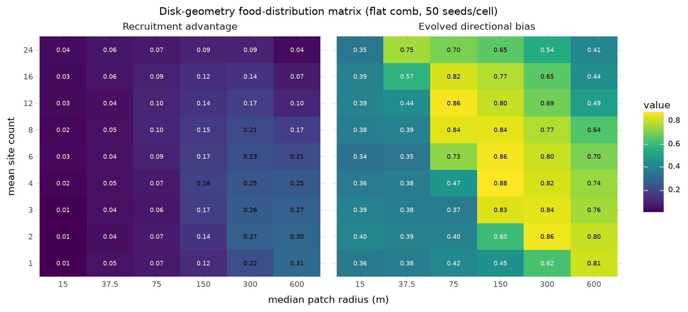
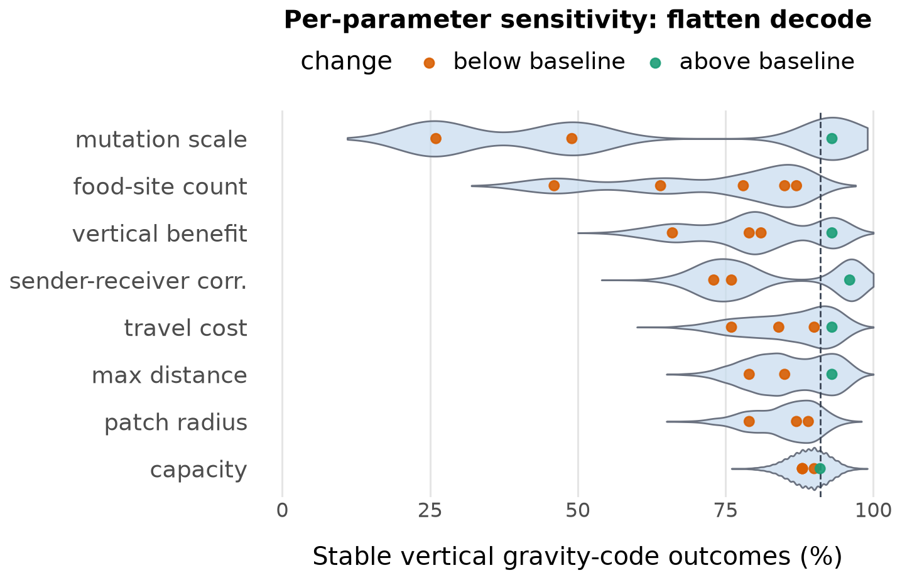
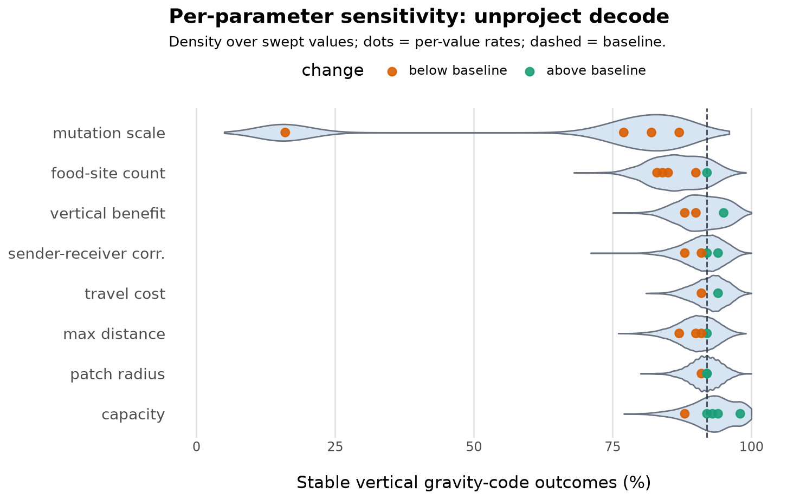
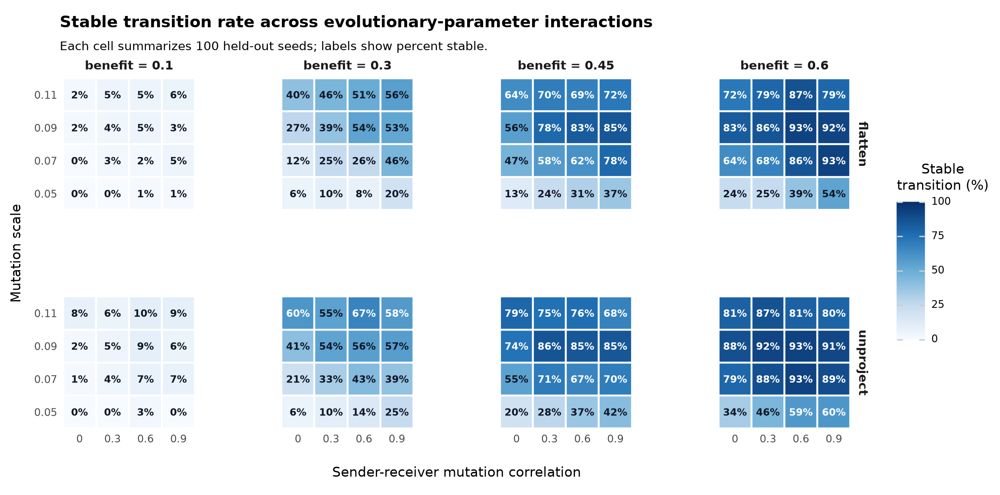

# Introduction

Honeybee waggle dances can recruit nestmates to resources away from the nest. One
ecological question is when a costly spatial signal is worth maintaining, and a second
evolutionary question is how a direct pointing signal could become a gravity-referenced
vertical-comb code. Empirical and theoretical work suggests that dance value depends on
resource density, patch size, reward, distance, and habitat [@sherman_visscher_2002;
@dornhaus_chittka_2004; @dornhaus_etal_2006; @beekman_lew_2008;
@donaldson_matasci_dornhaus_2012; @schurch_gruter_2014; @price_gruter_2015].

This report covers the current disk-geometry model run under two direct-decode variants
and their tracked result files. The model is intentionally small: it asks whether
horizontal-start populations can evolve both a vertical comb and a sender-receiver gravity
code under simple foraging, inheritance, and mutation rules. The two variants differ only
in how direct-pointing projects the food direction onto the comb plane -- the *flatten*
decode drops the component perpendicular to the comb plane, and the *unproject* decode
inverts that projection -- while all other model parameters and the evolutionary pipeline
structure are identical.

# Current Model

Colonies are the reproducing entities. Workers are behavioral samples from heritable
colony means. A colony has seven mean traits: directional-bias investment, receiver
attention, sender transposition, receiver transposition, search limit, comb tilt, and
comb orientation. Directional bias controls the concentration of dance signals; receiver
attention controls whether a worker follows an available dance; sender and receiver
transposition interpolate between direct pointing and a sun/gravity-referenced code.

Each foraging episode samples food sites from an ecologically grounded disk geometry,
with all lengths in meters. Food sites are physical disk patches whose radius is drawn per
site from a lognormal, independent of distance; the number of sites per episode is Poisson
with an evolving mean; each foray's outbound distance is drawn from a Gamma with the
colony's evolved mean rather than a hard range cutoff; a patch's capacity scales with its
area, so total resource grows with radius squared while per-visit value stays fixed; and
recruitment is itself an evolvable, capacity-conditional decision. Workers act
sequentially. If dances are available, a worker may follow one; otherwise it searches in a
random direction. A successful worker adds a dance for the discovered site with its
capacity-conditional propensity, whether it found the site independently or by following
another dance, so an exhausted patch never seeds a dance. Dance cost is paid for every
successful worker that produces a signal. The *Direct-Pointing Communication and Food
Distribution* section characterizes this ecology on a flat comb; the vertical-transition
pipelines then free the comb to tilt under the same geometry.

Comb geometry determines the available directional cues. Direct pointing projects the
horizontal food direction onto the comb plane. Gravity-referenced communication uses the
projection of gravity into the comb plane together with the episode sun azimuth. A
horizontal comb has no gravity reference in the dance plane; the gravity cue strengthens
as the comb becomes vertical. The transition experiments use axial comb orientation, so
orientations that differ by 180 degrees represent the same comb plane.

For a worker with sender transposition $s$, the encoded dance angle is a weighted
circular mean of direct and gravity-referenced angles:

$$
\mu =
\operatorname{cmean}\left(
  (D, (1-s)q_D),\,
  (G, sq_G)
\right).
$$

The emitted signal is sampled from a von Mises distribution centered on $\mu$, with
concentration proportional to directional-bias investment, and then perturbed by
production noise. A receiver with transposition $r$ applies the analogous weighted
decoding rule and interpretation noise.

Episode payoff is food value minus search/travel cost, dance cost, and attention cost.
A vertical comb can multiply net episode payoff:

$$
P_e = F_e (1 + \alpha t),
$$

where $t$ is comb tilt and $\alpha$ is the vertical-comb benefit. This benefit does
not rescue a colony whose foraging payoff has collapsed. Daughter colonies are sampled
in proportion to payoff. All heritable traits mutate with the shared mutation scale;
sender and receiver transposition mutations may be correlated by $\rho$.

Unless stated otherwise, runs use 60 colonies, 80 workers per colony, 120 generations, 50
foraging episodes per colony per generation, 12 foraging attempts per episode, food sites
750-6000 m from the nest, a median patch radius of 150 m (lognormal, log-sd 0.6), Gamma
forays (shape 2), area-scaled capacity, food value 1, travel cost 2.67e-5 per meter,
baseline dance cost 0, directional cue cost 0.02, attention cost 0.01, dance-production
noise 0.18, interpretation noise 0.12, within-colony worker variation 0.08, horizontal
initial combs, axial orientation, and the linear vertical-comb modifier $1+\alpha t$.

A seed is counted as a stable vertical gravity-code outcome when final mean comb tilt is
at least 0.80 and both final mean sender and receiver transposition are at least 0.50.
Gravity reached means both transposition traits crossed 0.50 at any generation. A seed
is counted as collapsed if mean success falls to 0.02 or below.

# Experiments

The disk-geometry model is exercised by a flat-comb experiment that characterizes the food
ecology, followed by a vertical-transition pipeline run under each direct-decode variant
(flatten and unproject). The two decode pipelines share the same stage structure and seed
panels and differ only in how direct pointing projects onto a tilted comb. Each stage reads
and writes tracked CSVs under `results/`.

| Pipeline | Stage | Source files | Seed panel |
|:---------|:------|:-------------|:-----------|
| Flat comb | Food-distribution grid | `results/food_distribution_disk_*` | seeds 400-449 |
| Transition (flatten) | Optuna search | `results/food_transition_disk_optuna_trials.csv`, `results/food_transition_disk_optuna_seed_metrics.csv` | 10 seeds/trial |
| Transition (flatten) | Candidate confirmation | `results/food_transition_disk_confirmation_*` | 40 seeds |
| Transition (flatten) | Held-out validation | `results/food_transition_disk_validation_*` | seeds 200-299 |
| Transition (flatten) | One-parameter sensitivity | `results/food_transition_disk_sensitivity_*` | 100 seeds |
| Transition (flatten) | Evolutionary interaction grid | `results/food_transition_disk_interaction.csv` | 100 seeds/cell |
| Transition (unproject) | Optuna search | `results/food_transition_disk_unproject_optuna_trials.csv`, `results/food_transition_disk_unproject_optuna_seed_metrics.csv` | 10 seeds/trial |
| Transition (unproject) | Candidate confirmation | `results/food_transition_disk_unproject_confirmation_*` | 40 seeds |
| Transition (unproject) | Held-out validation | `results/food_transition_disk_unproject_validation_*` | seeds 200-299 |
| Transition (unproject) | One-parameter sensitivity | `results/food_transition_disk_unproject_sensitivity_*` | 100 seeds |
| Transition (unproject) | Evolutionary interaction grid | `results/food_transition_disk_unproject_interaction.csv` | 100 seeds/cell |

Each transition Optuna search evaluated 1024 trials (ten seeds per trial) over the disk
ecology (food-site count, patch radius, capacity), the vertical-comb benefit, maximum food
distance, travel cost, mutation scale, and sender-receiver mutation correlation; food value
was fixed at 1.0. The objective prioritized stable seed count, then a bounded near-miss
progress score, and penalized collapse. Per-decode outcomes are reported in the *Vertical
Transition Under Disk Geometry* section below.

# Results

## Direct-Pointing Communication and Food Distribution

Before the vertical transition, a more basic question is when the direct-pointing
dance is worth maintaining at all. We test this on a comb held flat
(`evolve_comb_tilt` off, `initial_comb_tilt` 0), which leaves the gravity
reference strength at zero and the transposition traits inert, so only the
direct-pointing dance is in play, and we sweep the food ecology across 50
held-out seeds (400-449) over 60 generations.

This experiment lays out the disk-geometry ecology in full, all lengths in
meters. Food sites are physical
**disks** whose radius is drawn per site from a lognormal, independent of
distance; a forager captures a site when its straight outbound path intersects
the disk, so the effective angular tolerance is approximately
$\arcsin(\text{radius}/\text{distance})$ and *shrinks with distance*, because a
fixed patch subtends a smaller angle when farther away. Each foray's outbound
distance is drawn from a Gamma with the colony's evolved mean, rather than a hard
range cutoff. Total patch resource scales with area, so a disk's **capacity grows
with its radius squared** while per-visit value stays fixed. Recruitment is
itself an evolvable decision: a successful scout dances with probability
$1 - (1-s)^{c}$ given remaining capacity $c$, where the propensity $s$ is a
heritable trait, so an exhausted patch never seeds a dance. Finally the number of
sites per episode is Poisson with an evolving mean. The grid crosses mean site
count (1 to 24) against median patch radius (15 to 600 m); food sites sit
750-6000 m from the nest.

The outcome is the in-run *recruitment advantage*: among foraging attempts where
a dance was available, the success rate of dance-followers minus that of matched
non-followers (workers who could have followed but, by the receiver-attention
coin flip, searched at random). Because the follow decision is randomized within
the same episodes, this is a contemporaneous estimate of what the dance actually
buys, and it separates useful communication from a directional-bias trait that
has merely drifted upward under weak selection. The latter matters here: in the
smallest-patch ecologies mean directional bias still sits near 0.35-0.40, which
would clear a naive trait threshold, yet the dance is essentially useless
(recruitment advantage below 0.06, foraging success near zero).

<figure id="fig:food-distribution-disk-grid" class="figure">

<figcaption>
Recruitment advantage (left) and evolved directional bias (right) on a flat comb
across the full grid of mean site count against median patch radius, 50 seeds per
cell. Communication is favored along a diagonal band: bias lifts off a size
threshold that falls as patches become more numerous, while recruitment advantage
peaks for few large patches and erodes toward both small and abundant food.
</figcaption>
</figure>

Communication is favored along a diagonal band, not a single axis. Evolved
directional bias only lifts off its ~0.38 drift floor above a patch-size
threshold, and that threshold *falls as patches become more numerous*: a single
patch must reach ~600 m radius before a precise dance evolves (bias 0.81),
whereas at eight patches 75 m already suffices (0.84) and at twenty-four patches
even 37.5 m patches lift off (0.76). Below a few tens of meters, however, the
dance never evolves regardless of abundance -- the 15 m column stays at the drift
floor across the whole count axis -- so there is a minimum patch size below which
a pointing signal cannot help.

The recruitment advantage itself peaks for few, large patches (up to 0.31 at a
single 600 m patch) and erodes in two directions. Toward small patches it falls
because successful foragers are too rare to seed useful dances; toward many large
patches it falls because independent discovery already succeeds -- at twenty-four
600 m patches the advantage collapses to 0.04 even as foraging success reaches
0.88. Communication is therefore most valuable when food is spatially
concentrated but hard to stumble onto, and is suppressed at both the
undiscoverable and the abundant extremes. Unlike a directional-bias threshold,
the recruitment-advantage measure reports this directly and does not mistake
neutral drift for evolved communication.

We report the advantage as an absolute difference rather than a
follower-to-searcher success *ratio* for exactly this reason. A ratio (where 1
denotes no advantage in either direction) inverts the pattern: it peaks in the
small-patch corner (up to about 4.2 at a single 15 m patch), because there
dance-followers succeed several times as often as matched searchers even though
both almost always fail (roughly 1.5% versus 0.3% success). The ratio is
inflated by its near-zero denominator precisely where communication is least
useful in absolute terms, whereas the difference stays small and correctly
locates the strongest communication benefit at few large patches.

The evolvable dance propensity, by contrast, showed little structure across the
grid, settling near 0.6 everywhere. Under the current geometric form the dance
probability saturates to near one whenever more than one forager-load remains, so
the trait feels selection only at capacity-one patches and otherwise drifts;
making recruitment suppression evolve informatively would require a
less-saturating form together with a genuine cost of wasted recruitment.

## Vertical Transition Under Disk Geometry

The food-distribution grid above holds the comb flat. We now free it to tilt
(`evolve_comb_tilt` on, `initial_comb_tilt` 0) under the same disk ecology and
ask when a stable vertical gravity-code transition evolves. A positive
vertical-comb benefit
$\alpha$ rewards tilting, and once the comb stands vertical a gravity-referenced
(transposition) code can replace the sun-referenced direct pointer. We run the
full transition pipeline -- Optuna search, held-out validation, one-parameter
sensitivity, and an evolutionary-interaction grid -- under both direct-decode
variants (flatten and unproject). A seed is
stable when final mean comb tilt is at least 0.80 and both sender and receiver
transposition are at least 0.50, and it collapses if foraging success ever falls
to 0.02 or below.

### Optuna Search

Each decode ran a 1024-trial search (ten seeds per trial, 120 generations, 512
workers across sixteen Snellius nodes against one shared study), jointly
optimizing the disk ecology, $\alpha$, and the mutation parameters. Stable
transitions are common under both decodes, and unproject is slightly broader:

| Outcome | Flatten trials | Unproject trials |
|:--------|---------------:|-----------------:|
| Stable in all 10 seeds | 14 | 24 |
| Stable in $\geq 8$ seeds | 123 | 132 |
| Stable in $\geq 5$ seeds | 312 | 338 |
| Stable in $\geq 1$ seed | 611 | 641 |
| No stable seed | 413 | 383 |

Both searches concentrate their strongly stable trials in the same region. The
flatten trials with eight or more stable seeds occupy a coherent band of the
search space: denser, closer, reachable food paired with a strong tilt incentive.

| Parameter | Median | 10th-90th pct. |
|:----------|-------:|:---------------|
| Food-site count (Poisson mean) | 8 | 5-8 |
| Patch radius (m) | 210 | 165-345 |
| Patch capacity | 7 | 2-8 |
| Vertical-comb benefit $\alpha$ | 0.56 | 0.50-0.56 |
| Max food distance (m) | 3250 | 3250-5250 |
| Travel cost per meter | 2.5e-5 | 1.0e-5-2.5e-5 |
| Mutation scale | 0.110 | 0.090-0.110 |
| Sender-receiver correlation $\rho$ | 0.4 | 0.0-0.9 |

The transition favors many patches (a Poisson mean toward the top of the tested
1-8 range), radii of a couple hundred meters, distances near the short end of the
range (~3250 m), low travel cost, a high vertical-comb benefit, and a high
mutation scale; the sender-receiver mutation correlation is not decisive, its
stable range spanning almost the whole 0-1 axis. The transition's two sharpest
boundaries -- too few sites and too low a mutation scale -- both say the same
thing in metric terms: the gravity code stabilizes where recruitment has
enough findable, cheap-to-reach food to pay for itself. Mean foraging success
across the strongly stable trials is only 0.27, so the transition needs a
reliably communicable ecology rather than an abundant one. The evolvable dance
propensity again settles near neutral (mean 0.54 across the strongly stable set),
consistent with the flat-comb finding that its current geometric form feels
little selection.

| # | Sites | Radius (m) | Cap. | $\alpha$ | Max dist. (m) | Travel | Mut. sd | $\rho$ | $t_f$ | $m_f$ | Success |
|--:|------:|-----------:|-----:|---------:|--------------:|-------:|--------:|-------:|------:|------:|--------:|
| 600 | 5 | 315 | 5 | 0.60 | 6500 | 1.8e-5 | 0.090 | 1.0 | 0.87 | 0.83 | 0.25 |
| 770 | 7 | 225 | 7 | 0.50 | 3250 | 1.8e-5 | 0.110 | 0.1 | 0.84 | 0.76 | 0.28 |
| 877 | 8 | 210 | 7 | 0.56 | 3750 | 2.5e-5 | 0.110 | 0.0 | 0.85 | 0.76 | 0.28 |
| 879 | 7 | 210 | 7 | 0.56 | 3250 | 1.0e-5 | 0.110 | 0.0 | 0.83 | 0.77 | 0.27 |
| 909 | 8 | 165 | 7 | 0.56 | 3250 | 2.5e-5 | 0.110 | 0.5 | 0.84 | 0.78 | 0.23 |
| 301 | 7 | 105 | 2 | 0.54 | 3000 | 2.5e-5 | 0.110 | 0.1 | 0.86 | 0.72 | 0.12 |

Here $t_f$ is final mean comb tilt and $m_f$ the final mean of the lower sender or
receiver transposition.

### Held-Out Validation

The top five distinct candidates from each search were rerun on 100 held-out
seeds (200-299). Every candidate under both decodes produced frequent stable
transitions and no collapse events; stable rates ran 80-91 of 100 for flatten
and 82-92 for unproject. The strongest candidate of each decode:

| Decode | Candidate | Sites | Radius (m) | Cap. | $\alpha$ | Max dist. (m) | Travel | Mut. sd | $\rho$ | Stable | Success | $t_f$ | $m_f$ |
|:-------|:----------|------:|-----------:|-----:|---------:|--------------:|-------:|--------:|-------:|-------:|--------:|------:|------:|
| flatten | trial_729 | 5 | 315 | 4 | 0.56 | 3250 | 1.7e-5 | 0.070 | 0.9 | 91/100 | 0.348 | 0.845 | 0.782 |
| unproject | trial_541 | 7 | 315 | 12 | 0.60 | 4750 | 1.0e-5 | 0.090 | 0.4 | 92/100 | 0.350 | 0.848 | 0.734 |

The two decodes land on very similar held-out rates (91 and 92 of 100) and on
overlapping ecologies -- large patches (315 m), short-to-moderate distances, low
travel cost, high benefit -- confirming that the search-stage region carries over
to unseen seeds.

### Sensitivity

A one-parameter sweep around each validated baseline (100 seeds) identifies the
sharpest boundary: the **mutation scale**. Lowering
it collapses the transition -- flatten falls from 91/100 at the baseline to
49/100 at mutation 0.05, and unproject falls to 16/100 at 0.04 -- while the
baseline mutation of 0.07-0.09 sits safely on the plateau. The sharpest
*ecological* boundary is **food-site count** under flatten (46/100 at a Poisson
mean of two sites, rising to 87/100 at seven); unproject is more robust to count
(83-92/100 across four to nine sites). Vertical-comb benefit and sender-receiver
correlation are monotone and moderate (flatten stable rises from 66 to 93 as
$\alpha$ goes 0.44 to 0.60, and from 73 to 96 as $\rho$ goes 0.4 to 1.0). Patch
radius, capacity, distance, and travel cost are comparatively flat within the
tested ranges (79-98/100).

The distributions below make the per-parameter picture direct: for each parameter
a violin pools the seed-bootstrap stable-rate draws over its swept values (dots
mark the per-value rates, orange below and green above the dashed baseline), with
parameters sorted by worst-case drop. Mutation scale is the widest, most
collapse-prone lever under both decodes; the ecological parameters are wide under
flatten (food-site count especially) but hug the baseline under unproject.

<figure id="fig:sensitivity-flatten-report" class="figure">

<figcaption>
One-parameter sensitivity of the flatten decode. Each parameter's violin is a
seed-bootstrap stable-rate density over its swept values; dots are the per-value
rates and the dashed line the baseline. Parameters are sorted by worst-case drop
(shared order and x-range with the unproject panel below).
</figcaption>
</figure>

<figure id="fig:sensitivity-unproject-report" class="figure">

<figcaption>
One-parameter sensitivity of the unproject decode, drawn as above. Mutation scale
is again the sharpest boundary (a lone collapse at 0.04), while every other
parameter stays tightly at baseline -- unproject is markedly more robust to
food-site count than flatten.
</figcaption>
</figure>

### Evolutionary Interaction

Holding each validated ecology fixed, we cross vertical-comb benefit, mutation
scale, and sender-receiver correlation on a grid re-centred on the disk stable
region (benefit 0.10/0.30/0.45/0.60, mutation 0.05-0.11, correlation 0.0-0.9; 100
seeds per cell, no collapse events under either decode). The vertical-comb benefit
is the dominant lever, and unproject is again slightly more robust than flatten:

| Vertical-comb benefit $\alpha$ | Flatten mean / best | Unproject mean / best |
|-------------------------------:|:--------------------|:----------------------|
| 0.10 | 3 / 6 | 5 / 10 |
| 0.30 | 32 / 56 | 40 / 67 |
| 0.45 | 58 / 85 | 64 / 86 |
| 0.60 | 70 / 93 | 78 / 93 |

Mean and best are stable seeds of 100 across the sixteen mutation-by-correlation
cells at each benefit. Stable rate rises steeply with benefit under both decodes:
at the lowest benefit ($\alpha = 0.10$) the transition all but vanishes (best cell
6/100 flatten, 10/100 unproject), while from $\alpha = 0.30$ upward it recovers and
by $\alpha = 0.60$ the best cells reach 93/100 under both decodes. Within each
benefit the best cells pair a high mutation scale (0.07-0.11) with high correlation
(0.6-0.9), and at every benefit level unproject clears a broader swath of the grid
than flatten -- consistent with its cleaner selective pressure for the gravity code.

<figure id="fig:interaction-heatmap-report" class="figure">

<figcaption>
Stable-transition rate across the evolutionary-interaction grid, 100 held-out
seeds per cell. Tiles show percent stable over sender-receiver correlation (x)
against mutation scale (y), faceted by vertical-comb benefit (columns) and decode
(rows: flatten above, unproject below). Stable rate climbs with benefit and, within
each benefit, with mutation scale and correlation; unproject clears a broader region
than flatten at every benefit.
</figcaption>
</figure>

# Conclusion

In the current disk-geometry model, horizontal-start colonies can reliably evolve a
vertical comb and a gravity-referenced sender-receiver code under both direct-decode
variants tested. The strongest flatten-decode candidate (`trial_729`) is stable in 91 of
100 held-out seeds, and the strongest unproject-decode candidate (`trial_541`) in 92 of
100 -- on overlapping ecologies of large patches, short-to-moderate distances, low travel
cost, and a high vertical-comb benefit.

The result is conditional, not universal. The transition depends on an ecology with
enough recruitable food sites, a substantial vertical-comb benefit, and mutation
parameters that let comb tilt and sender-receiver transposition move together. Too few
food sites or too small a mutation scale returns the population to productive but flat
direct pointing.

The decode-method comparison adds a robustness check: the transition is not an artifact
of the flatten projection. It arises under both geometric decode methods, with unproject
clearing a slightly broader region of both the Optuna search and the interaction grid --
consistent with its cleaner selective pressure for the gravity code.

The main conclusion is therefore modest: within an ecologically grounded disk geometry the
model contains a reproducible transition corridor under both decode methods, but that
corridor is parameter-dependent. The next scientific step is to test whether the same
transition remains under more explicit biological constraints on the vertical-comb benefit
and foraging ecology.

# Reproducibility

The working report is `report/report.md` and is rendered with:

```sh
python -u experiments/render_report_html.py
```

The food-distribution grid figure in this report was regenerated from tracked CSVs with:

```sh
python -u experiments/plot_food_distribution_disk_grid.py
```

The evolutionary-interaction heatmap was regenerated from the tracked interaction
summaries with:

```sh
python -u experiments/plot_food_transition_disk_interaction_heatmap.py
```

The flat-comb food-distribution experiment is produced on Snellius with:

```sh
bash experiments/submit_food_distribution_disk_snellius.sh
```

The vertical-transition pipeline under both direct-decode variants (flatten and unproject)
is run on Snellius with:

```sh
bash experiments/submit_food_transition_disk_pipeline_snellius.sh
```

Results are kept in sync between the local and Snellius checkouts through git (commit and
push run outputs rather than copying result CSVs between machines).

# References
